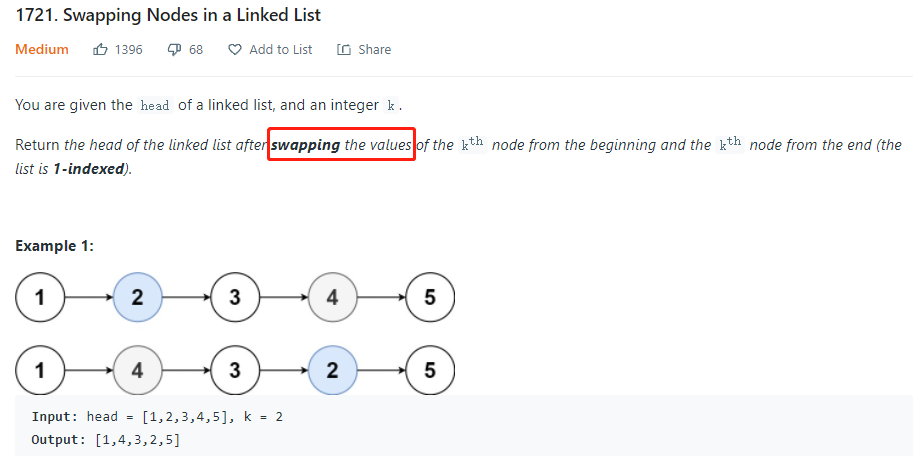

# LeetCodeNotes
#### Description: Summary of what I have gained while practicing LeetCode questions. I would suggest memorize what I wrote down here.

## LinkedList 
**Timeline (Jan. 24 - Feb. 15)**
1. Given the `head` of a linked list and an integer `val`, remove all the nodes of the linked list that has `Node.val == val`, and return the new `head` (L203).
    <p align="center">
        
    </p>
    
    * ```python
      class Solution:
          def removeElements(self, head, val):
              """
          :type head: ListNode
          :type val: int
          :rtype: ListNode
          """

          dummy_head = ListNode(-1)
          dummy_head.next = head

          curr = dummy_head
          while curr.next:
              if curr.next.val == val:
                  curr.next = curr.next.next
              else:
                  curr = curr.next

          return dummy_head.next
    * It is enlightened to create a dummy node prefix to the given head node and loop in that way to remove nodes.
    * It is also useful to use dummy node to get a pointer pointing to the last node of the linked list:
      * ```python
        dummy_head = ListNode(-1)
        dummy_head.next = head

        curr = dummy_head
        while curr.next:
            curr = curr.next
        ```

2. Given the `head` of the linked list and get the middle node using fast and slow pointers. Remember the slow point always stops at index `n // 2`, where `n` is the number of nodes in the linked list and index starts from `0`.
    * ```python
      # The head node is given as input
      slow, fast = head, head
      # Get middle of linked list
	  while fast and fast.next:
		  fast = fast.next.next
		  slow = slow.next
      ```
    * Furthermore, we can summarize this idea into this trick. If `endNode` is `k` positions behind a certain node called `currentNode`, when `currentNode` reaches the end            (`None`) of linked list, i.e, at the `n-th` node, the `endNode` would be at the `(n - k)-th` node. From the coding perspective, if we want to get the `k-th` node from the        end of linked list (linked list is `1-indexed`), then:
      ```python
      kth_node_from_end = None
      index = 1
        
      curr = head
      while curr:
          if kth_node_from_end:
              kth_node_from_end = kth_node_from_end.next
                
          if index == k:
              kth_node_from_end = head
                
          curr = curr.next
          index += 1
      ```
       * It is very important to note here that in the while loop, we should check whether the `kth_node_from_end` is None before assigning it to `head`. Since when the                  condition `index == k` satisfies, we don't want to assign the `kth_node_from_end` to `head` and then also move it to the next node in that iteration.
       * It is wrong to write the condition for while loop as `while curr.next:` as it will always fail (i.e. AttributeError: `NoneType` object has no attribute `val`) when `k`          has the same value as `n`, where `n` is the number of nodes in the linked list.

3. Reverse linked list given the `head` node.
    * ```python
      curr, prev = head, None
      while curr:       
		    curr.next, prev, curr = prev, curr, curr.next
	
      # Return the head of reversed linked list
      return prev
      ```
      or 
    * ```python
      class Solution:
      # @param {ListNode} head
      # @return {ListNode}
      def reverseList(self, head):
          prev = None
          while head:
              curr = head
              head = head.next
              curr.next = prev
              prev = curr
          return prev
      ```
4. Sometimes do check whether we need to swap two actual nodes or we (can) just (need to) swap the `val` field within nodes.
    <p align="center">
        
    </p>
    
100. Some problems I didn't come up with a good idea when I first try to solve them. Maybe worth revisiting.
     * Easy: L1474, L705, L706, L716
     * Medium: L1265 (Important Follow-up Questions), L369, L1019
