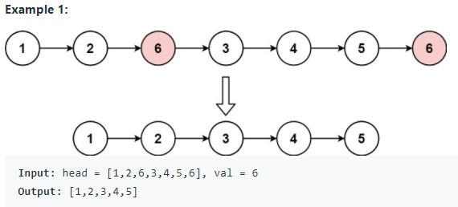

# LeetCodeNotes
#### Description: Summary of what I have gained while practicing LeetCode questions. I would suggest memorize what I wrote down here.

## LinkedList 
**Timeline (Jan. 24 - Feb. 15)**
1. Given the `head` of a linked list and an integer `val`, remove all the nodes of the linked list that has `Node.val == val`, and return the new `head` (L203).
    <p align="center">
        
    </p>
    
    * ```python
      class Solution:
          def removeElements(self, head, val):
              """
          :type head: ListNode
          :type val: int
          :rtype: ListNode
          """

          dummy_head = ListNode(-1)
          dummy_head.next = head

          curr = dummy_head
          while curr.next:
              if curr.next.val == val:
                  curr.next = curr.next.next
              else:
                  curr = curr.next

          return dummy_head.next
      ```
      * It is enlightened to create a dummy node prefix to the given head node and loop in that way to remove nodes.

2. Given the `head` of a linked list and get a pointer pointing to the last node.
      * ```python
        curr = head
        while curr.next:
            curr = curr.next
        ```
	
3. Given the `head` of the linked list and get the middle node using fast and slow pointers. Remember the slow point always stops at index `n // 2`, where `n` is the number of nodes in the linked list and index starts from `0`.
    * ```python
      # The head node is given as input
      slow, fast = head, head
      # Get middle of linked list
	  while fast and fast.next:
		  fast = fast.next.next
		  slow = slow.next
      ```
    * Furthermore, we can summarize this idea into this trick. If `endNode` is `k` positions behind a certain node called `currentNode`, when `currentNode` reaches the end            (`None`) of linked list, i.e, at the `n-th` node, the `endNode` would be at the `(n - k)-th` node. From the coding perspective, if we want to get the `k-th` node from the        end of linked list (linked list is `1-indexed`), then:
      ```python
      kth_node_from_end = None
      index = 1
        
      curr = head
      while curr:
          if kth_node_from_end:
              kth_node_from_end = kth_node_from_end.next
                
          if index == k:
              kth_node_from_end = head
                
          curr = curr.next
          index += 1
      ```
       * It is very important to note here that in the while loop, we should check whether the `kth_node_from_end` is None before assigning it to `head`. Since when the                  condition `index == k` satisfies, we don't want to assign the `kth_node_from_end` to `head` and then also move it to the next node in that iteration.
       * It is wrong to write the condition for while loop as `while curr.next:` as it will always fail (i.e. AttributeError: `NoneType` object has no attribute `val`) when `k`          has the same value as `n`, where `n` is the number of nodes in the linked list.

4. Reverse linked list given the `head` node.
    * ```python
      curr, prev = head, None
      while curr:       
		    curr.next, prev, curr = prev, curr, curr.next
	
      # Return the head of reversed linked list
      return prev
      ```
      or 
    * ```python
      class Solution:
      # @param {ListNode} head
      # @return {ListNode}
      def reverseList(self, head):
          prev = None
          while head:
              curr = head
              head = head.next
              curr.next = prev
              prev = curr
          return prev
      ```
5. Sometimes do check whether we need to swap two actual nodes or we (can) just (need to) swap the `val` field within nodes.
    <p align="center">
        
    </p>

6. [L445](https://leetcode.com/problems/add-two-numbers-ii/): You are given two non-empty linked lists representing two non-negative integers. The most significant digit comes first and each of their nodes contains a single digit. Add the two numbers and return the sum as a linked list. You may assume the two numbers do not contain any leading zero, except the number 0 itself. See constraints and follow-up questions in the link.
    <p align="center">
        
    </p>
    
    * ```python
      class Solution:
          def addTwoNumbers(self, l1: Optional[ListNode], l2: Optional[ListNode]) -> Optional[ListNode]:
              st1 = []
              st2 = []
        
              while l1:
                  st1.append(l1.val)
                  l1 = l1.next
            
              while l2:
                  st2.append(l2.val)
                  l2 = l2.next
            
			carry = 0
			res_head = None

			while st1 or st2:
			    x1 = st1.pop() if st1 else 0
			    x2 = st2.pop() if st2 else 0

			    val = (carry + x1 + x2) % 10
			    carry = (carry + x1 + x2) // 10

			    curr = ListNode(val)
			    curr.next = res_head
			    res_head = curr

			if carry:
			    curr = ListNode(carry)
			    curr.next = res_head
			    res_head = curr

			return res_head
      ```
      * Remember the part where we add two numbers digit by digit and maintain a `carry` variable from the least significant digit.
      * We use two `stacks` to solve it without reversing the input lists.

7. [L114](https://leetcode.com/problems/flatten-binary-tree-to-linked-list/): Given the `root` of a binary tree, flatten the tree into a "linked list":
    * The "linked list" should use the same `TreeNode` class where the right child pointer points to the next node in the list and the left child pointer is always `null`.
    * The "linked list" should be in the same order as a pre-order traversal of the binary tree.
     <p align="center">
        
     </p>
    
    * ```python
      class Solution:
          def flatten(self, root: Optional[TreeNode]) -> None:
              """
              Do not return anything, modify root in-place instead.
              """
              head, prev = None, None
        
              def preOrder(root):
                  nonlocal head, prev
            
                  if not root:
                      return
            
                  root_right = root.right
            
                  if not head:
                      head, prev = root, root
                  else:
                      prev.right = root
                      prev.left = None
                      prev = root
            
                  preOrder(root.left)
                  preOrder(root_right)
        
              if not root:
                  return
        
              preOrder(root)
              return head
      ```
      * The key insight here is that I should understand/know clearly what `preOrder` is trying to do (Think of it as an API or a black box even if I haven't implemented it yet) when implementing this type of recursion compared with CSC148 recursion problems (The ones usually have a return value(s) or just a simple print statement in tree traversal problems). Therefore, what `preOrder` does is that it flattens input binary tree nodes into a "linked list" and link its head to the current root. And since we want to flatten the binary tree into a "linked list" in the same order as a pre-order traversal of the binary tree. So, in our case, when we call `preOrder(root.left)` it will flatten the left subtree of current `root` and then link its head to the `right` of current `root`. However, this will change the `root.right` before calling `preOrder(root.right)`. Thus, the line `root_right = root.right` to save the right subtree of the current `root` before we actually try to do something within `preOrder` is very important and it is easy to make mistakes if you don't know the essence of this recursion function.

8. [L109](https://leetcode.com/problems/convert-sorted-list-to-binary-search-tree/): Given the `head` of a singly linked list where elements are sorted in ascending order, convert it to a height balanced BST. For this problem, a height-balanced binary tree is defined as a binary tree in which the depth of the two subtrees of every node never differ by more than 1.
     <p align="center">
        
     </p>
     
     * ```python
       class Solution:
           def sortedListToBST(self, head: Optional[ListNode]) -> Optional[TreeNode]:
               if not head:
                   return
        
               if not head.next:
                   return TreeNode(head.val)
        
               slow, fast = head, head.next.next
               while fast and fast.next:
                   fast = fast.next.next
                   slow = slow.next

               root = TreeNode(slow.next.val)
               root.right = self.sortedListToBST(slow.next.next)
               slow.next = None
               root.left = self.sortedListToBST(head)
        
               return root
       ```
       * place holder

     * ```python
       class Solution:
           def getSize(self, head):
               curr = head
               size = 0
        
               while curr:
                   size += 1
                   curr = curr.next
            
               return size
        
           def sortedListToBST(self, head: Optional[ListNode]) -> Optional[TreeNode]:
               def formBST(start, end):
                   if start > end:
                       return 
            
                   nonlocal head
            
                   mid = (start + end) // 2
            
                   left = formBST(start, mid - 1)
                   root = TreeNode(head.val)
                   root.left = left
            
                   head = head.next
            
                   right = formBST(mid + 1, end)
                   root.right = right
            
                   return root
		   
               if not head:
                   return 
		   
               size = self.getSize(head)
               root = formBST(1, size) # goes same with root = formBST(0, size - 1)
               return root
       ```
         * place holder

100. Some problems I didn't come up with a good idea when I first try to solve them. Maybe worth revisiting.
     * Easy: [L1474](https://leetcode.com/problems/delete-n-nodes-after-m-nodes-of-a-linked-list/), [L705](https://leetcode.com/problems/design-hashset/), [L706](https://leetcode.com/problems/design-hashmap/), [L716](https://leetcode.com/problems/max-stack/)
     * Medium: [L1265](https://leetcode.com/problems/print-immutable-linked-list-in-reverse/) (Important Follow-up Questions), [L369](https://leetcode.com/problems/plus-one-linked-list/), [L1019](https://leetcode.com/problems/next-greater-node-in-linked-list/), [L382](https://leetcode.com/problems/linked-list-random-node/)([Reservoir Sampling](https://leetcode.com/problems/linked-list-random-node/discuss/85659/Brief-explanation-for-Reservoir-Sampling), [Mathematical Proof](resources/reservoir_sampling.pdf)), [L430](https://leetcode.com/problems/flatten-a-multilevel-doubly-linked-list/), [L445](https://leetcode.com/problems/add-two-numbers-ii/)(Pay attention to details in implementation), [L114](https://leetcode.com/problems/flatten-binary-tree-to-linked-list/), [L116](https://leetcode.com/problems/populating-next-right-pointers-in-each-node/), [L1670](https://leetcode.com/problems/design-front-middle-back-queue/) (Use 2 double-ended queues (`collections.deque` in python): one for the first half and one for the second half. Maintain after each operation to make sure the `len(first)` is either `len(second) - 1` or `len(second)`. When calling `popMiddle()`, if `(len(first) + len(second)) % 2 == 1`, then `return second.popleft()` else `return first.pop()`), [L109](https://leetcode.com/problems/convert-sorted-list-to-binary-search-tree/)
