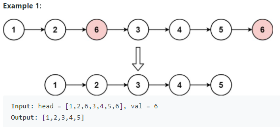
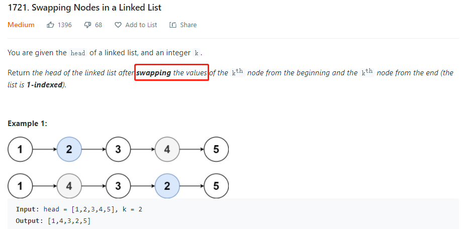
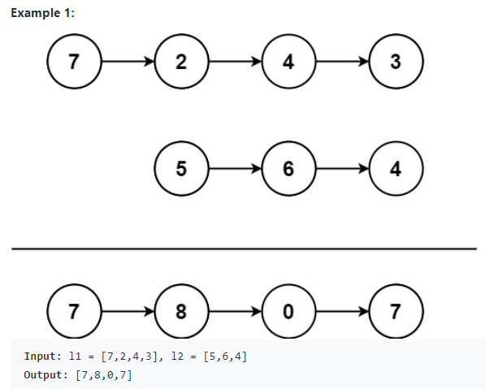
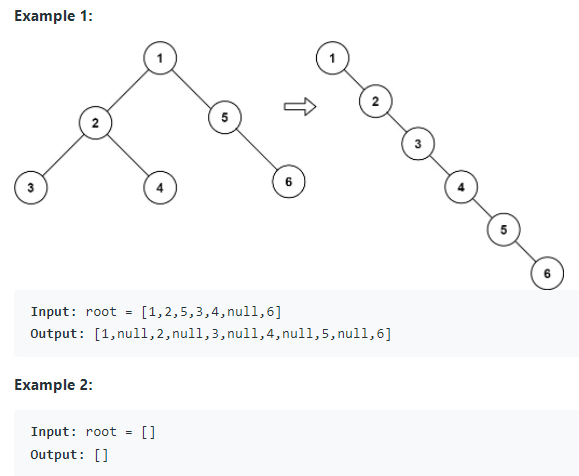
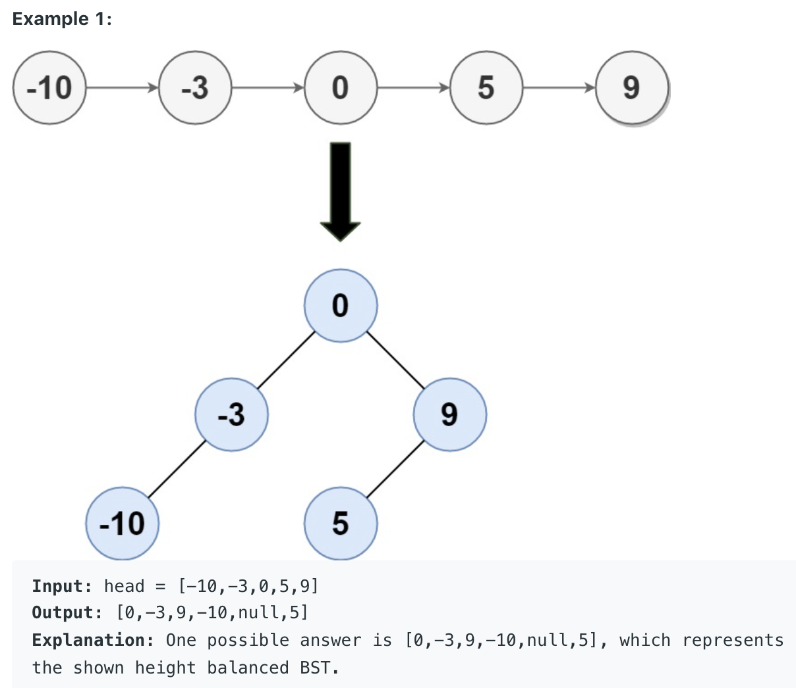
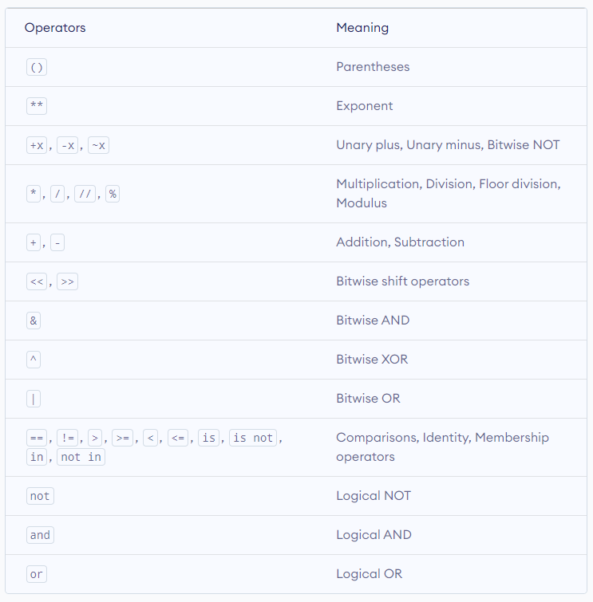

# Linked List 
**Timeline (Jan. 24 - Feb. 15)**
1. Given the `head` of a linked list and an integer `val`, remove all the nodes of the linked list that has `Node.val == val`, and return the new `head` (L203).
    <p align="center">
        
    </p>
    
    * ```python
      class Solution:
          def removeElements(self, head, val):
              """
              :type head: ListNode
              :type val: int
              :rtype: ListNode
              """

              dummy_head = ListNode(-1)
              dummy_head.next = head

              curr = dummy_head
              while curr.next:
                  if curr.next.val == val:
                      curr.next = curr.next.next
                  else:
                      curr = curr.next

              return dummy_head.next
      ```
      * It is enlightened to create a dummy node prefix to the given head node and loop in that way to remove nodes.

2. Given the `head` of a linked list and get a pointer pointing to the last node.
      * ```python
        curr = head
        while curr.next:
            curr = curr.next
        ```
	
3. Given the `head` of the linked list and get the middle node using fast and slow pointers. Remember the slow point always stops at index `n // 2`, where `n` is the number of nodes in the linked list and index starts from `0`.
    * ```python
      # The head node is given as input
      slow, fast = head, head
      # Get middle of linked list
      while fast and fast.next:
	      fast = fast.next.next
	      slow = slow.next
      ```
    * Furthermore, we can summarize this idea into this trick. If `endNode` is `k` positions behind a certain node called `currentNode`, when `currentNode` reaches the end            (`None`) of linked list, i.e, at the `n-th` node, the `endNode` would be at the `(n - k)-th` node. From the coding perspective, if we want to get the `k-th` node from the        end of linked list (linked list is `1-indexed`), then:
      ```python
      kth_node_from_end = None
      index = 1
        
      curr = head
      while curr:
          if kth_node_from_end:
              kth_node_from_end = kth_node_from_end.next
                
          if index == k:
              kth_node_from_end = head
                
          curr = curr.next
          index += 1
      ```
       * It is very important to note here that in the while loop, we should check whether the `kth_node_from_end` is None before assigning it to `head`. Since when the                  condition `index == k` satisfies, we don't want to assign the `kth_node_from_end` to `head` and then also move it to the next node in that iteration.
       * Memorize the template and note the while loop condition is `while curr:`. Some related problems: [L19](https://leetcode.com/problems/remove-nth-node-from-end-of-list/).
       * It is wrong to write the condition for while loop as `while curr.next:` as it will always fail (i.e. AttributeError: `NoneType` object has no attribute `val`) when `k`          has the same value as `n`, where `n` is the number of nodes in the linked list.

4. Reverse linked list given the `head` node.
    * ```python
      curr, prev = head, None
      while curr:       
		  curr.next, prev, curr = prev, curr, curr.next
	
      # Return the head of reversed linked list
      return prev
      ```
      or 
    * ```python
      class Solution:
          def reverseList(self, head):
              prev = None
              while head:
                  curr = head
                  head = head.next
                  curr.next = prev
                  prev = curr
              return prev
      ```
    * [L92](https://leetcode.com/problems/reverse-linked-list-ii/): Given the `head` of a singly linked list and two integers `left` and `right` where `left <= right`, reverse the nodes of the list from position `left` to position `right`, and return the reversed list.
      * ```python
        class Solution:
            def reverseBetween(self, head: Optional[ListNode], left: int, right: int) -> Optional[ListNode]:
                if left == right:
                    return head
        
                dummy_head = ListNode(-1)
                dummy_head.next = head
        
                prev = dummy_head
                for i in range(left - 1):
                    prev = prev.next
            
                start = prev.next
                then = start.next
        
                for i in range(right - left):
                    start.next = then.next
                    then.next = prev.next
                    prev.next = then
                    then = start.next
            
                return dummy_head.next
        ```
	    * To clarify, all you're doing is inserting `then` between `prev` and `prev.next`. You keep moving `then` forward by 1 until you reach the difference, `right - left`, and you keep making `start.next` point to `then.next` to ensure it's always pointing to the tail part of the list.

5. Sometimes do check whether we need to swap two actual nodes or we (can) just (need to) swap the `val` field within nodes.
    <p align="center">
        
    </p>

6. [L445](https://leetcode.com/problems/add-two-numbers-ii/): You are given two non-empty linked lists representing two non-negative integers. The most significant digit comes first and each of their nodes contains a single digit. Add the two numbers and return the sum as a linked list. You may assume the two numbers do not contain any leading zero, except the number 0 itself. See constraints and follow-up questions in the link.
    <p align="center">
        
    </p>
    
    * ```python
      class Solution:
          def addTwoNumbers(self, l1: Optional[ListNode], l2: Optional[ListNode]) -> Optional[ListNode]:
              st1 = []
              st2 = []
        
              while l1:
                  st1.append(l1.val)
                  l1 = l1.next
            
              while l2:
                  st2.append(l2.val)
                  l2 = l2.next
            
			carry = 0
			res_head = None

			while st1 or st2:
			    x1 = st1.pop() if st1 else 0
			    x2 = st2.pop() if st2 else 0

			    val = (carry + x1 + x2) % 10
			    carry = (carry + x1 + x2) // 10

			    curr = ListNode(val)
			    curr.next = res_head
			    res_head = curr

			if carry:
			    curr = ListNode(carry)
			    curr.next = res_head
			    res_head = curr

			return res_head
      ```
      * Remember the part where we add two numbers digit by digit and maintain a `carry` variable from the least significant digit.
      * We use two `stacks` to solve it without reversing the input lists.

7. [L114](https://leetcode.com/problems/flatten-binary-tree-to-linked-list/): Given the `root` of a binary tree, flatten the tree into a "linked list":
    * The "linked list" should use the same `TreeNode` class where the right child pointer points to the next node in the list and the left child pointer is always `null`.
    * The "linked list" should be in the same order as a pre-order traversal of the binary tree.
     <p align="center">
        
     </p>
    
    * ```python
      class Solution:
          def flatten(self, root: Optional[TreeNode]) -> None:
              """
              Do not return anything, modify root in-place instead.
              """
              head, prev = None, None
        
              def preOrder(root):
                  nonlocal head, prev
            
                  if not root:
                      return
            
                  root_right = root.right
            
                  if not head:
                      head, prev = root, root
                  else:
                      prev.right = root
                      prev.left = None
                      prev = root
            
                  preOrder(root.left)
                  preOrder(root_right)
        
              if not root:
                  return
        
              preOrder(root)
              return head
      ```
      * The key insight here is that I should understand/know clearly what `preOrder` is trying to do (Think of it as an API or a black box even if I haven't implemented it yet) when implementing this type of recursion compared with CSC148 recursion problems (The ones usually have a return value(s) or just a simple print statement in tree traversal problems). Therefore, what `preOrder` does is that it flattens input binary tree nodes into a "linked list" and link its head to the current root. And since we want to flatten the binary tree into a "linked list" in the same order as a pre-order traversal of the binary tree. So, in our case, when we call `preOrder(root.left)` it will flatten the left subtree of current `root` and then link its head to the `right` of current `root`. However, this will change the `root.right` before calling `preOrder(root.right)`. Thus, the line `root_right = root.right` to save the right subtree of the current `root` before we actually try to do something within `preOrder` is very important and it is easy to make mistakes if you don't know the essence of this recursion function.

8. [L109](https://leetcode.com/problems/convert-sorted-list-to-binary-search-tree/): Given the `head` of a singly linked list where elements are sorted in ascending order, convert it to a height balanced BST. For this problem, a height-balanced binary tree is defined as a binary tree in which the depth of the two subtrees of every node never differ by more than 1.
     <p align="center">
        
     </p>
     
     * ```python
       class Solution:
           def sortedListToBST(self, head: Optional[ListNode]) -> Optional[TreeNode]:
               if not head:
                   return
        
               if not head.next:
                   return TreeNode(head.val)
        
               slow, fast = head, head.next.next
               while fast and fast.next:
                   fast = fast.next.next
                   slow = slow.next

               root = TreeNode(slow.next.val)
               root.right = self.sortedListToBST(slow.next.next)
               slow.next = None
               root.left = self.sortedListToBST(head)
        
               return root
       ```
       * Converting the linked list to height balanced BST can be solved by **finding the mid point of the linked list and then recurse on the first half and second half.**
       * Once we have the middle node of the linked list, we disconnect the portion of the list to the left of the middle node. The way we do this is by setting `fast = head.next.next` and adding a base case accounting for this line. For disconnecting the left portion we simply do `slow.next = None` since `slow` now points to the node just before the middle node.

     * ```python
       class Solution:
           def getSize(self, head):
               curr = head
               size = 0
        
               while curr:
                   size += 1
                   curr = curr.next
            
               return size
        
           def sortedListToBST(self, head: Optional[ListNode]) -> Optional[TreeNode]:
               def formBST(start, end):
                   if start > end:
                       return 
            
                   nonlocal head
            
                   mid = (start + end) // 2
            
                   left = formBST(start, mid - 1)
                   root = TreeNode(head.val)
                   root.left = left
            
                   head = head.next
            
                   right = formBST(mid + 1, end)
                   root.right = right
            
                   return root
		   
               if not head:
                   return 
		   
               size = self.getSize(head)
               root = formBST(1, size) # goes same with root = formBST(0, size - 1)
               return root
       ```
         * `start` and `end` parameters represent the starting and ending indices for the linked list. The key insight here is that function `formBST(start, end)` will move the `head` pointer in the linked list to point to the middle node (which becomes the root) of the portion of linked list (indicated by indices `start` and `end`), convert the portion of linked list to a height balanced BST, and then return the root node. So, we simply use the current value pointed to by `head` as the root node and progress the `head` node by once i.e. `head = head.next`. 
         * Elements processed in the inorder traversal on a binary search tree turn out to be sorted in ascending order. The second approach listed here make use of this idea to formulate the construction of a binary search tree. The reason we are able to use this idea in this problem is because we are given a **sorted** linked list initially.

9. [L148](https://leetcode.com/problems/sort-list/): Given the `head` of a linked list, return the list after sorting it in ascending order.

  * If we look at various sorting algorithms, _Mergesort_ is one of the efficient sorting algorithms that is popularly used for sorting the linked list. The mergesort algorithm runs in `O(nlogn)` time in all the cases. _Quicksort_ is also one of the efficient algorithms with the average time complexity of `O(nlogn)`. But the worst-case time complexity is `O(n^2)`. Also, variations of the quicksort like randomized quicksort are not efficient for the linked list because unlike arrays, random access in the linked list is not possible in `O(1)` time. If we sort the linked list using quicksort, we would end up using the `head` as a pivot element which may not be efficient in all scenarios.
  * In the top-down solution, space complexity is `O(logn)`, where `n` is the number of nodes in linked list. Since the problem is recursive, we need additional space to store the recursive call stack. The maximum depth of the recursion tree is `logn`. Note that we need to use the fast and slow pointers method to find the node just before the middle node. Therefore, we need to disconnect the portion of the list to the left of the middle node by setting `fast = head.next.next` and adding a base case `if not head.next: return head` accounting for it. For disconnecting the left portion we simply do `slow.next = None`.
  * In the bottom-up solution, space complexity is `O(1)`. [Bottom-up Solution in Python](https://leetcode.com/submissions/detail/638306894/) or [Bottom-up Solution in Java (Discussion)](https://leetcode.com/problems/sort-list/discuss/46712/Bottom-to-up(not-recurring)-with-o(1)-space-complextity-and-o(nlgn)-time-complextity). And for this solution, I'd suggest understanding the idea at least and remembering the code since you are not likely to come up with an elegant, bug-free answer for the follow-up question (i.e. you can only use constant extra space to solve it and this indicates the bottom-up approach) in the real interview with pressure.

10. When using `head` and `tail` pointers to manipulate (double) linked list and removing some nodes from both front and rear of the (double) linked list, we should always remember to check below edge cases: 
    * ```python 
      if not self.head: 
          self.tail = self.head    
      ```
      or
      ```python 
      if not self.tail: 
          self.head = self.tail    
      ```

11. [L147](https://leetcode.com/problems/insertion-sort-list/): Given the `head` of a singly linked list, sort the list using insertion sort, and return the sorted list's head. Below is the insertion sort approach on linked list, I'd suggest remembering it.
    * ```python
      class Solution:
          def insertionSortList(self, head: Optional[ListNode]) -> Optional[ListNode]:
              dummy_head = ListNode(-1)
        
              prev = dummy_head
              curr = head   # the current processing node will be inserted
              while curr:
                  next_node = curr.next   # save the next node as we will modify the curr.next pointer later
		  
                  # find the right place to insert the node
                  while prev.next and prev.next.val < curr.val:
                      prev = prev.next
                
	              # insert between pre and pre.next
                  curr.next = prev.next
                  prev.next = curr
                  prev = dummy_head
                  curr = next_node
            
              return dummy_head.next
      ```
        * After creating a dummy node prefix to the original `head` node and using this `while prev.next and prev.next.val < curr.val: prev = prev.next` while loop, we can find the right place to insert a node and, at the same time, the corner cases for inserting both at the front and the rear of the linked list are handled.

12. The operator precedence in Python is listed in the following table. It is in descending order (upper group has higher precedence than the lower ones).
    <p align="center">
       
    </p>

100. Some problems I didn't come up with a good idea when I first try to solve them. Maybe worth revisiting.
   * **Easy**: [L1474](https://leetcode.com/problems/delete-n-nodes-after-m-nodes-of-a-linked-list/), [L705](https://leetcode.com/problems/design-hashset/), [L706](https://leetcode.com/problems/design-hashmap/), [L716](https://leetcode.com/problems/max-stack/)
   * **Medium**: [L1265](https://leetcode.com/problems/print-immutable-linked-list-in-reverse/) (Important Follow-up Questions), [L369](https://leetcode.com/problems/plus-one-linked-list/), [L1019](https://leetcode.com/problems/next-greater-node-in-linked-list/), [L382](https://leetcode.com/problems/linked-list-random-node/)([Reservoir Sampling](https://leetcode.com/problems/linked-list-random-node/discuss/85659/Brief-explanation-for-Reservoir-Sampling), [Mathematical Proof](../resources/reservoir_sampling.pdf)), [L430](https://leetcode.com/problems/flatten-a-multilevel-doubly-linked-list/), [L445](https://leetcode.com/problems/add-two-numbers-ii/) (Pay attention to details in implementation), [L114](https://leetcode.com/problems/flatten-binary-tree-to-linked-list/), [L116](https://leetcode.com/problems/populating-next-right-pointers-in-each-node/) (Review this problem together with [L117](https://leetcode.com/problems/populating-next-right-pointers-in-each-node-ii/)), [L1670](https://leetcode.com/problems/design-front-middle-back-queue/) (Use 2 double-ended queues (`collections.deque` in python): one for the first half and one for the second half. Maintain after each operation to make sure the `len(first)` is either `len(second) - 1` or `len(second)`. When calling `popMiddle()`, if `(len(first) + len(second)) % 2 == 1`, then `return second.popleft()` else `return first.pop()`), [L109](https://leetcode.com/problems/convert-sorted-list-to-binary-search-tree/), [L148](https://leetcode.com/problems/sort-list/) (Just understand and remember the bottom-up solution (idea) and pray you can come up with a bug-free answer in the interview : ) ), [L2074](https://leetcode.com/problems/reverse-nodes-in-even-length-groups/) (Lots of implementation details), [L86](https://leetcode.com/problems/partition-list/), [L143](https://leetcode.com/problems/reorder-list/), [L138](https://leetcode.com/problems/copy-list-with-random-pointer/), [L142](https://leetcode.com/problems/linked-list-cycle-ii/) ([Floyd's cycle detection algorithm](https://cs.stackexchange.com/questions/10360/floyds-cycle-detection-algorithm-determining-the-starting-point-of-cycle)), [L1171](https://leetcode.com/problems/remove-zero-sum-consecutive-nodes-from-linked-list/) (Prefix Sum + HashMap), [L146](https://leetcode.com/problems/lru-cache/) (Double Linked List (`head` always points to the least recentely used node and `tail` always points to the most recently used node) + Hashmap (for the `get` method to be bounded within O(1))), [L708](https://leetcode.com/problems/insert-into-a-sorted-circular-linked-list/) (Need to consider and handle many cases), [L355](https://leetcode.com/problems/design-twitter/), [L61](https://leetcode.com/problems/rotate-list/)
   * **Hard**: [L1206](https://leetcode.com/problems/design-skiplist/) (Skip List: [slides](../resources/MIT6_046JS15_lec07.pdf), [lecture video](https://ocw.mit.edu/courses/electrical-engineering-and-computer-science/6-046j-design-and-analysis-of-algorithms-spring-2015/lecture-videos/lecture-7-randomization-skip-lists/)), [L460](https://leetcode.com/problems/lfu-cache/) (3 HashMaps: [key: Node], [key: counts], [counts: Double Linked List Instance (head)]), [L432](https://leetcode.com/problems/all-oone-data-structure/) ([Answer](https://leetcode.com/problems/all-oone-data-structure/discuss/91428/Python-solution-with-detailed-comments))
