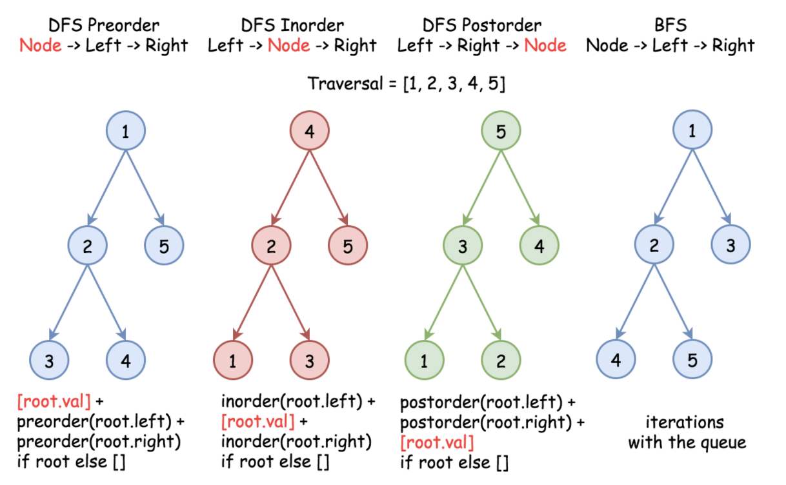
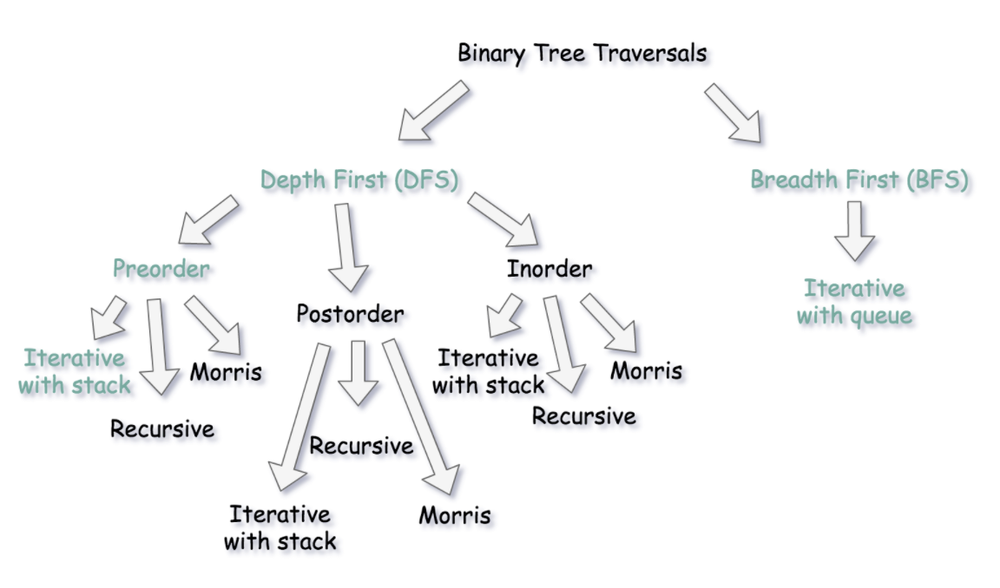

# Tree
**Timeline (Feb. 24 - )**
1. How to traverse the tree? There are two general strategies to traverse a tree:
  * **Depth First Search (DFS)**
    * In this strategy, we adopt the **depth** as the priority, so that one would start from a root and reach all the way down to certain leaf, and then back to root to reach another branch. The DFS strategy can further be distinguished as **preorder**, **inorder**, and **postorder** depending on the relative order among the root node, left node and right node.
  * **Breadth First Search (BFS)**
    * We scan through the tree level by level, following the order of height, from top to bottom. The nodes on higher level would be visited before the ones with lower levels.
    
    <p align="center">
        
    </p>

2. [Master Theorem](../resources/master_theorem.pdf) for calculating the time complexity for recursion problems.

3. A [node](https://en.wikipedia.org/wiki/Node_(computer_science)) is a structure which may contain a value or condition, or represent a separate data structure (which could be a tree of its own). Each node in a tree has zero or more **child nodes**, which are below it in the tree (by convention, trees are drawn growing downwards). A node that has a child is called the child's **parent node** (or superior). A node has at most one parent, but possibly many ancestor nodes, such as the parent's parent. Child nodes with the same parent are **sibling nodes**.
    * An **internal node** (also known as an **inner node**, **inode** for short, or **branch node**) is any node of a tree that has child nodes. Similarly, an **external node** (also known as an **outer node**, **leaf node**, or **terminal node**) is any node that does not have child nodes.
    * The **depth** of a node is the length of the path to its root (i.e., its root path). This is commonly needed in the manipulation of the various self-balancing trees, [AVL Trees](https://en.wikipedia.org/wiki/AVL_tree) in particular. 
      * The empty node (None) has depth -1.
      * The root node has depth 0. 
    * The **height** of a node is the length of the longest downward path to a leaf from that node, or equivalently, the depth of its deepest node. The height of the root is the height of the tree. 
      * The empty node (None) has height -1.
      * Leaf nodes have height 0.
      * For every node, `height = 1 + max(left_tree_height, right_tree_height)`
    * The **diameter** of a tree is the length of the longest path between any two nodes in a tree. 
      * [L543](https://leetcode.com/problems/diameter-of-binary-tree/): For every node, `diameter = left_tree_height + right_tree_height + 2`.
 
4. Binary tree iterative traversal summary:
  
    <p align="center">
        
    </p>
    
    * Preorder traversal:

     ```python
     class Solution:
         def preorderTraversal(self, root: Optional[TreeNode]) -> List[int]:
             st, res = [], []
        
             while st or root:
                 if root:
                     res.append(root.val)
                     st.append(root)
                     root = root.left
                 else:
                     node = st.pop()
                     root = node.right
             return res
     ```
     or 
       
     ```python
     class Solution:
         def preorderTraversal(self, root: Optional[TreeNode]) -> List[int]:
             st, res = [root], []
        
             while st:
                 node = st.pop()
                 
                 if not root:
                     continue
                 else:
                     res.append(node.val)
                     st.append(node.right)
                     st.append(node.left)
             return res
      ```
       
     * Inorder traversal:

      ```python
      class Solution:
          def inorderTraversal(self, root: Optional[TreeNode]) -> List[int]:
              st, res = [], []
        
              while st or root:
                  if root:
                      st.append(root)
                      root = root.left
                  else:
                      node = st.pop()
                      res.append(node.val)
                      root = node.right
                
              return res
      ```
     * Postorder traversal:

      ```python
      class Solution:
          def postorderTraversal(self, root: Optional[TreeNode]) -> List[int]:
              st, res = [root], []
        
              while st:
                  node = st.pop()
            
                  if not node:
                      continue
                  else:
                      res.append(node.val)
                      st.append(node.left)
                      st.append(node.right)
                
              return res[::-1]
      ```
              
5. [L654](https://leetcode.com/problems/maximum-binary-tree/) Linear time solution with a stack to construct the maximum binary tree:
   ```python
   class Solution:
       def constructMaximumBinaryTree(self, nums: List[int]) -> Optional[TreeNode]:
           if not nums:
               return
        
           st = []
           last_pop = None
        
           for num in nums:
               node = TreeNode(num)
            
               while st and st[-1].val < num:
                   last_pop = st.pop()
                
               if st:
                   st[-1].right = node
            
               if last_pop:
                   node.left = last_pop
                
               st.append(node)
               last_pop = None
            
           return st[0]
    ```
           
6. [L1008](https://leetcode.com/problems/construct-binary-search-tree-from-preorder-traversal/) Given an array of integers `preorder`, which represents the preorder traversal of a BST (i.e., binary search tree), construct the tree and return its root:
  * Iterative solution:
    ```python
    class Solution:
        def bstFromPreorder(self, preorder: List[int]) -> Optional[TreeNode]:
            root = TreeNode(preorder[0])
            st = [root]
        
            for num in preorder[1:]:
                last_pop = None
                node = TreeNode(num)
            
                if num < st[-1].val:
                    st[-1].left = node 
                else:
                    while st and st[-1].val < num:
                        last_pop = st.pop()
                    
                    last_pop.right = node
                
                st.append(node)
            
            return root
    ```

  * Recursive solution:
    ```python
    class Solution:
        def bstFromPreorder(self, preorder: List[int]) -> Optional[TreeNode]:
            idx = 0
            n = len(preorder)
        
            def helper(l, h):
                nonlocal idx, n
            
                if idx == n:
                    return
            
                val = preorder[idx]
                if val < l or val > h:
                    return
            
                idx += 1
                root = TreeNode(val)
                root.left = helper(l, val)
                root.right = helper(val, h)
            
                return root
        
            return helper(float('-inf'), float('inf'))
    ```
7. [L1457](https://leetcode.com/problems/pseudo-palindromic-paths-in-a-binary-tree/): The necessary and sufficient condition of pseudo-palindromic is that at most one digit has odd occurrence. The solution idea would be `normal DFS + int[10] (store digit occurrences) + backtrack`.

8. [L919](https://leetcode.com/problems/complete-binary-tree-inserter/): Store tree nodes to a list `self.tree` in BFS order. For the `i-th` tree node, node `self.tree[i]` has left child `self.tree[2 * i + 1]` and `self.tree[2 * i + 2]`. So when inserting the `N-th` node (0-indexed), we push it into the list. We can then find its parent `self.tree[(N - 1) // 2]` directly, where `N` is the length of the list `self.tree` before pushing the node that we want to insert.
    * Takeaway: Memorize the index property of Complete Binary Tree (CBT).

9. [L510](https://leetcode.com/problems/inorder-successor-in-bst-ii/): 
    * If the `node` has a right child, and hence its successor is somewhere lower in the tree. Go to the right once and then as many times to the left as you could. Return the `node` you end up with.
    * `Node` has no right child, and hence its successor is somewhere upper in the tree. Go up till the `node` that is left child of its parent. The answer is the parent.

10. How to build an undirected graph representation given a tree root node ([L863](https://leetcode.com/problems/all-nodes-distance-k-in-binary-tree/))?
    * Use a recursive DFS function:
      ```python
      m = collections.defaultdict(list)
      
      def build_graph_dfs(parent, child):
          # both parent and child are not empty
          if parent and child:
              # build an undirected graph representation, assign the
              # child value for the parent as the key and vice versa
              m[parent.val].append(child.val)
              m[child.val].append(parent.val)
              
          # traversal
          if child.left: 
              connect(child, child.left)
          if child.right: 
              connect(child, child.right)
          
      # To call the above function and note that the initial parent node of the root is None
      build_graph_dfs(None, root)
      ```

11. Some problems I didn't come up with a good idea when I first try to solve them. Maybe worth revisiting:
  * **Easy**: [L1022](https://leetcode.com/problems/sum-of-root-to-leaf-binary-numbers/), [L235](https://leetcode.com/problems/lowest-common-ancestor-of-a-binary-search-tree/) (In BST, the lowest common ancestor (LCA) of given input `p` and `q` is the split node which has the property: `p.val <= node.val <= q.val` or `q.val <= node.val <= p.val`). [L108](https://leetcode.com/problems/convert-sorted-array-to-binary-search-tree/), [L993](https://leetcode.com/problems/cousins-in-binary-tree/), [L543](https://leetcode.com/problems/diameter-of-binary-tree/), [L703](https://leetcode.com/problems/kth-largest-element-in-a-stream/), [L101](https://leetcode.com/problems/symmetric-tree/), [L501](https://leetcode.com/problems/find-mode-in-binary-search-tree/)
  * **Medium**: [L236](https://leetcode.com/problems/lowest-common-ancestor-of-a-binary-tree/solution/), [L654](https://leetcode.com/problems/maximum-binary-tree/) ([Linear Time Construction](https://leetcode.com/problems/maximum-binary-tree/discuss/258364/Python-O(n)-solution-with-explanation.), [Further Topics: RMQ, LCA, and LA](https://ocw.mit.edu/courses/electrical-engineering-and-computer-science/6-851-advanced-data-structures-spring-2012/lecture-videos/session-15-static-trees/)), [L1305](https://leetcode.com/problems/all-elements-in-two-binary-search-trees/submissions/), [L894](https://leetcode.com/problems/all-possible-full-binary-trees/) ([Catalan Number: number of full binary trees](https://en.wikipedia.org/wiki/Catalan_number)), [L1506](https://leetcode.com/problems/find-root-of-n-ary-tree/), [L701](https://leetcode.com/problems/insert-into-a-binary-search-tree/) (Key insight: you could always insert new node as a child of the leaf), [L1104](https://leetcode.com/problems/path-in-zigzag-labelled-binary-tree/), [L1522](https://leetcode.com/problems/diameter-of-n-ary-tree/), [L1660](https://leetcode.com/problems/correct-a-binary-tree/), [L979](https://leetcode.com/problems/distribute-coins-in-binary-tree/), [L1586](https://leetcode.com/problems/binary-search-tree-iterator-ii/) ([Two stacks](https://leetcode.com/problems/binary-search-tree-iterator-ii/discuss/877467/Java-two-stacks-without-modifying-the-tree)), [L889](https://leetcode.com/problems/construct-binary-tree-from-preorder-and-postorder-traversal/), [L1666](https://leetcode.com/problems/change-the-root-of-a-binary-tree/), [L1740](https://leetcode.com/problems/find-distance-in-a-binary-tree/) (1. Get the LCA of `p` and `q`; 2. The answer is the sum of distances between `p-LCA` and `q-LCA`), [L1257](https://leetcode.com/problems/smallest-common-region/), [L1245](https://leetcode.com/problems/tree-diameter/), [L1273](https://leetcode.com/problems/delete-tree-nodes/), [L1530](https://leetcode.com/problems/number-of-good-leaf-nodes-pairs/), [L666](https://leetcode.com/problems/path-sum-iv/) ([Takeway: how to build a tree with a hashmap and traverse through it?](https://leetcode.com/problems/path-sum-iv/discuss/106892/Java-solution-Represent-tree-using-HashMap)), [L1372](https://leetcode.com/problems/longest-zigzag-path-in-a-binary-tree/) ([Answer](https://leetcode.com/problems/longest-zigzag-path-in-a-binary-tree/discuss/531867/JavaPython-DFS-Solution)), [L96](https://leetcode.com/problems/unique-binary-search-trees/) ([DP](https://leetcode.com/problems/unique-binary-search-trees/discuss/31666/DP-Solution-in-6-lines-with-explanation.-F(i-n)-G(i-1)-*-G(n-i)) or [Catalan Number](https://www.geeksforgeeks.org/total-number-of-possible-binary-search-trees-with-n-keys/)), [L449](https://leetcode.com/problems/serialize-and-deserialize-bst/) (Preorder + Queue), [L536](https://leetcode.com/problems/construct-binary-tree-from-string/) (Pretty hard question and definitely worth a review), [L222](https://leetcode.com/problems/count-complete-tree-nodes/) ([Answer](https://leetcode.com/problems/count-complete-tree-nodes/discuss/61958/Concise-Java-solutions-O(log(n)2))), [L958](https://leetcode.com/problems/check-completeness-of-a-binary-tree/submissions/) (When level-order traversal in a complete tree, after the last node, all nodes in the queue should be `None`. Otherwise, the tree is not complete.), [L1145](https://leetcode.com/problems/binary-tree-coloring-game/), [L314](https://leetcode.com/problems/binary-tree-vertical-order-traversal/), [L437](https://leetcode.com/problems/path-sum-iii/), [L99](https://leetcode.com/problems/recover-binary-search-tree/) ([The first element that is placed wrong is always larger than its next one while the second element that is placed wrong is always smaller than its previous one](https://leetcode.com/problems/recover-binary-search-tree/discuss/32535/No-Fancy-Algorithm-just-Simple-and-Powerful-In-Order-Traversal)), [L988](https://leetcode.com/problems/smallest-string-starting-from-leaf/) (Understand what is [lexicographically smaller](https://en.wikipedia.org/wiki/Lexicographic_order)), [L549](https://leetcode.com/problems/binary-tree-longest-consecutive-sequence-ii/), [L255](https://leetcode.com/problems/verify-preorder-sequence-in-binary-search-tree/), [L742](https://leetcode.com/problems/closest-leaf-in-a-binary-tree/) ([Construct undirected graph from given tree root and then perform a BFS](https://leetcode.com/problems/closest-leaf-in-a-binary-tree/discuss/109934/Intuitive-Python-O(n)-BFS-on-Undirected-Graph)), [L331](https://leetcode.com/problems/verify-preorder-serialization-of-a-binary-tree/) (Remember this [answer](https://leetcode.com/problems/verify-preorder-serialization-of-a-binary-tree/discuss/78551/7-lines-Easy-Java-Solution)), [L1339](https://leetcode.com/problems/maximum-product-of-splitted-binary-tree/), [L333](https://leetcode.com/problems/largest-bst-subtree/)
